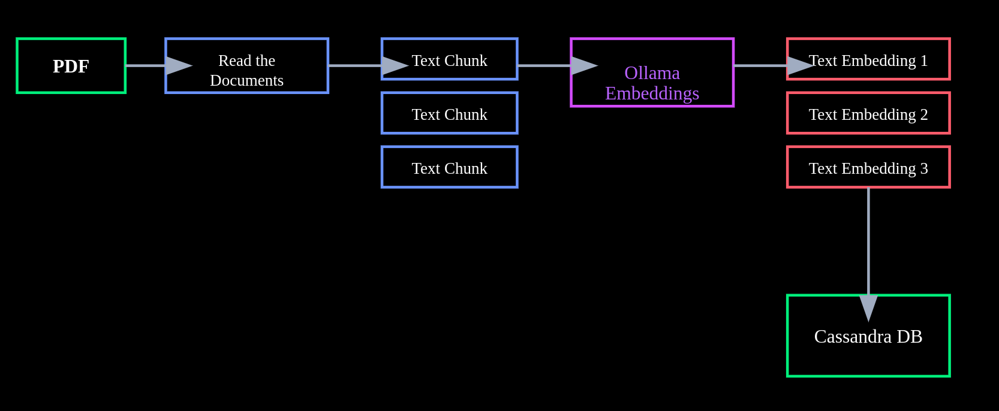
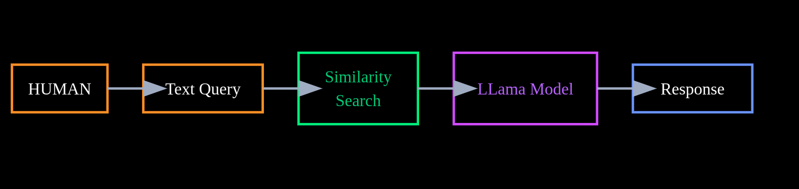

# PDF Query RAG Application on Indian Government Budget Speech 2024

This project implements a PDF Query Retrieval-Augmented Generation (RAG) system for analyzing and querying the **Indian Government Budget Speech 2024**. The application leverages **Cassandra**, **Ollama Embeddings**, and **LLama 3** to efficiently extract insights from large text documents.

**Link to Document:** [Indian Government Budget Speech 2024](https://www.indiabudget.gov.in/)


## Introduction

The Indian Government Budget Speech 2024 encompasses extensive information across various sectors. This application aims to simplify the process of extracting key insights from the budget by allowing users to query the speech and receive relevant, contextually enriched answers. 

## Tech Stack

- **Python**, **Langchain**
- **Cassandra**: NoSQL database for storing vector embeddings.
- **Ollama Embeddings**: For converting text chunks into vectors.
- **LLama 3**

## System Architecture

### Workflow Diagram

The high-level architecture of the system is as follows:





## Installation and Setup

### Prerequisites

1. **Cassandra**: Set up a Cassandra database at https://astra.datastax.com/
2. **Python 3.10 or 3.10+**: Make sure you have Python installed.

### Steps to Run the Project

1. **Clone the Repository**

   ```bash
   git clone https://github.com/ankitmishralive/BudgetSpeech_2024_RAGusing_langchain-cassandra-llama
   cd indian-budget-pdf-query

### Key Addition:
- **Install Dependencies**: Added a line for installing dependencies from the `requirements.txt` file after cloning the repository.

Let me know if you need any more changes or additional information!

## Author

-  [ankitmishralive](https://github.com/ankitmishralive)
